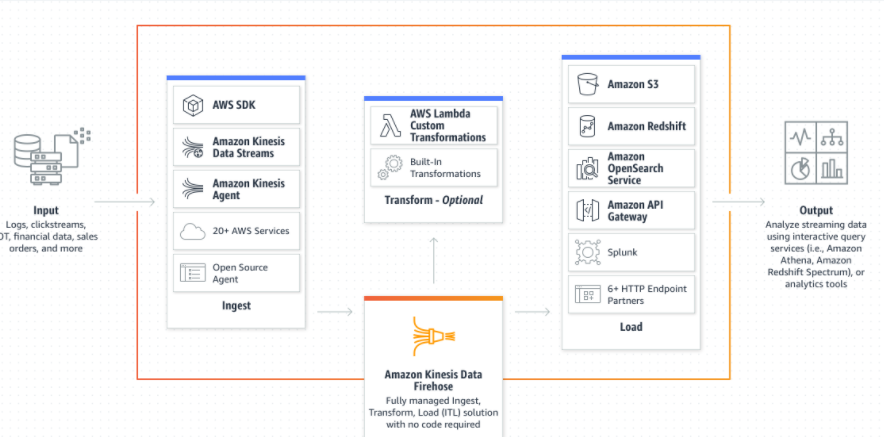

# notes-cloudcomputing
This repository is to document the learnings on Cloud computing

## Contents
- [AWS](#AWS)
- [Azure](#Azure)

## AWS

### Amazon Kinesis Data Firehose
Amazon Kinesis Data Firehose is an extract, transform, and load (ETL) service that reliably captures, transforms, and delivers streaming data to data lakes, data stores, and analytics services..

- [Link to doc: Amazon Kinesis Data Firehose](https://docs.aws.amazon.com/firehose/latest/dev/what-is-this-service.html) 
   
( _⬇ click below to enlarge image_)
 

## Azure

- Write something here
-- Drag and drop images (requires your Dropbox account be linked)
- Import and save files from GitHub, Dropbox, Google Drive and One Drive
- Drag and drop markdown and HTML files into Dillinger
- Export documents as Markdown, HTML and PDF
